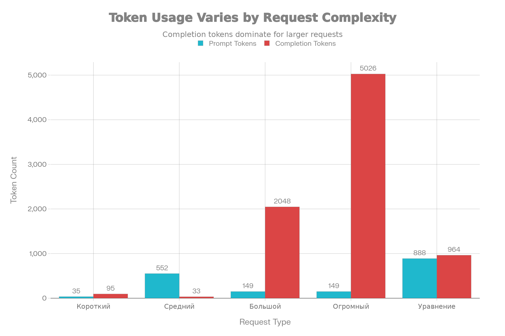
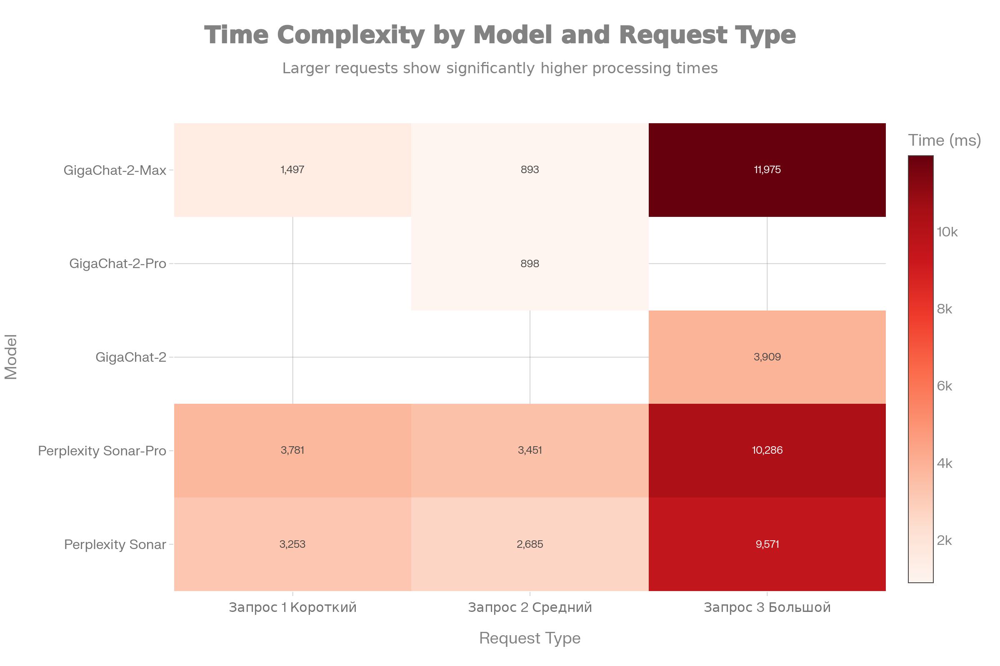

Расход токенов по сложности запроса
Анализ показывает чёткую корреляцию между сложностью запроса и расходом токенов:

Короткий запрос ("Сколько будет 2+3?"): от 21 до 47 токенов в зависимости от модели. Perplexity sonar использует наименьшее количество токенов (21), а sonar-pro требует больше (47). GigaChat-2-Max находится посередине с 27 токенами.

Средний запрос (задача о кредите): расход возрастает до 138-155 токенов. Интересно, что Perplexity sonar и sonar-pro затрачивают одинаковое количество токенов на запрос (142), но отличаются в генерации ответа (13 и 11 токенов соответственно). GigaChat модели показывают более экономный расход на запрос (134 токена).

Большой запрос (компоненты Android, максимум 512 токенов): все модели вырабатывают примерно 550 токенов, что указывает на попадание в лимит maxTokens=512 для ответа.

Очень большой запрос (максимум 8192 токена): расход значительно возрастает до 1155-1605 токенов. GigaChat-2 генерирует самый объёмный ответ (1605 токенов), Perplexity sonar-pro показывает наиболее компактный результат (1155 токенов).

Распределение по времени

